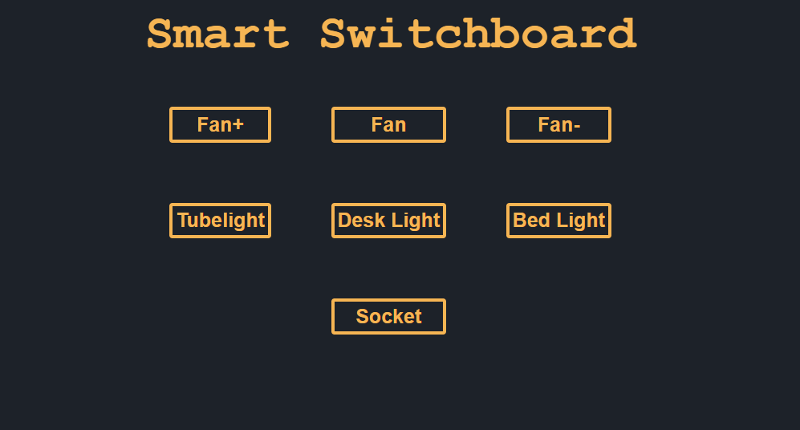

# Smart Switchboard
Usually smart devices require you to keep the switch on, making the switchboard useless. This smart switchboard solves that problem by making the switches smart directly.

  

# Working
This uses an ESP32 to control relays connected with my lights and a socket. I have a smart fan and the ESP32 will use its API to control the smart fan. 

It has 4 push buttons and a rotary encoder switch with RGB LEDs to control the devices.

# Schematic
Here is the schematic. 

  

All the parts should be soldered directly since the microcontroller is to be kept a bit far away from the live AC current wires so that it works the best.

# CAD model
This is the model to be 3D printed. It has holes to place the push buttons, LEDs and the rotary encoder switch

  

It also has space to stick a socket in the back. 

  

I measured everything like the screw holes, socket size and the borders with my existing switchboard to ensure everything fits in place

  

Credits for knob model -
[Jack](https://www.printables.com/model/243409-crown-knob/files)

# Firmware
I have created a firmware which launches a webserver to control all the devices including 3 lights, a socket and a fan. 

  

I have a smart fan with a remote. I also have a IR blaster which I will use to control the fan. The code to control the fan via the IR blaster's API will not be pushed to github for obvious reasons. I dont want people around the world to control my fan. 

The firmware is made such that you could seamlessly switch the control between controlling from webserver or with physical buttons. The lights will also update in the switchboard as you change status of any device

The firmware right now is not the best or perfect since I have no way to run the code and check if it works. I will test it properly once I actually get my hands on the hardware.

# BOM
 - 1x  3D printed base
 - 1x  ESP32
 - 1x  Rotary Encoder Switch
 - 1x  5V 2A Power Supply
 - 4x  Push buttons
 - 4x  5V 30A Relays
 - 15x WS2812B RGB LEDs
For testing out stuff - 
 - 1x  Breadboard
 - 40x jumper wires