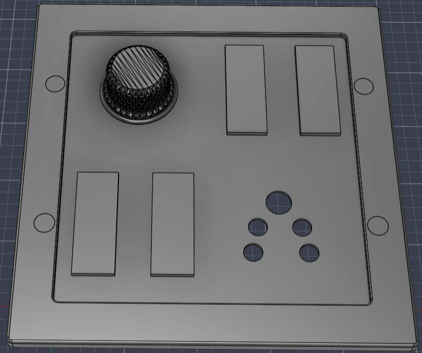
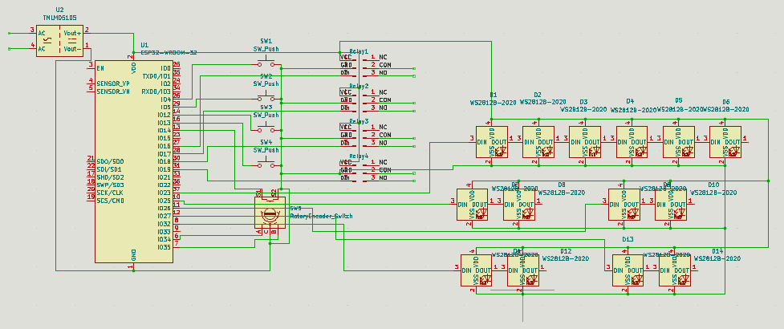
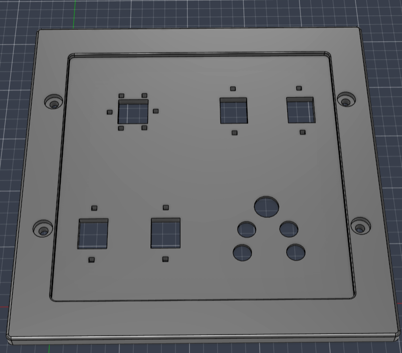
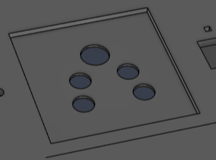
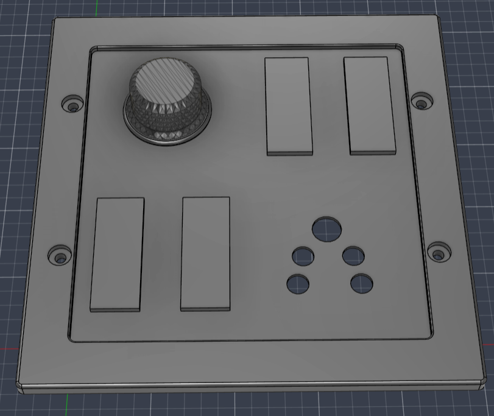

# Smart Switchboard
Usually smart devices require you to keep the switch on, making the switchboard useless. This smart switchboard solves that problem by making the switches smart directly.

  

# Working
This uses an ESP32 to control relays connected with my lights and a socket. I have a smart fan and the ESP32 will use its API to control the smart fan. 

It has 4 push buttons and a rotary encoder switch with RGB LEDs to control the devices.

# Schematic
Here is the schematic. 

  

All the parts should be soldered directly since the microcontroller is to be kept a bit far away from the live AC current wires so that it works the best.

# CAD model
This is the model to be 3D printed. It has holes to place the push buttons, LEDs and the rotary encoder switch

  

It also has space to stick a socket in the back. 

  

I measured everything like the screw holes, socket size and the borders with my existing switchboard to ensure everything fits in place

  

# Firmware

# BOM
 - 1x  3D printed base
 - 1x  ESP32
 - 1x  Rotary Encoder Switch
 - 1x  5V 2A Power Supply
 - 4x  Push buttons
 - 4x  5V 30A Relays
 - 15x WS2812B RGB LEDs